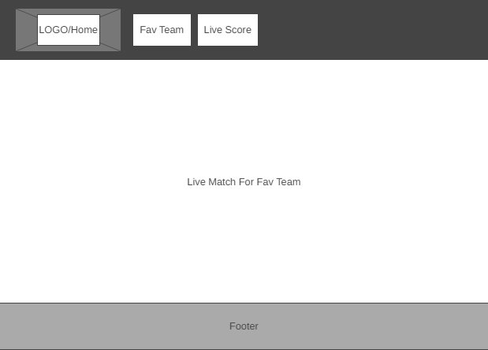

# Golden Goal

## Members

1- Thaer Braizat

2- Nedal Alashqar

3- Qasem Mohammad

4- Saif Momani

5- Mohammad Lababneh

## Description

goldengoal.com is a website that allows you to pick your favourite team and keep track of their results and achievements, such as their results from previous days, or keep track of their live score if you're unable to watch the game live, check the starting squad for the match and many other features available through the API-FOOTBALL API.

## wireframe

## User Stories

1. As a user ,I want the ability to see the  club world ranking 
 Feature Tasks: 
 the user can see the club world ranking in front page 
 Acceptance Tests:
 ensure the  club world ranking uptodate 

2. As a user ,I want the ability to pick favourite teams
 Feature Tasks: 
 the user can fill a form to pick favourite team
 Acceptance Tests:
 ensure that the user login to be able to pick a favourite team

3. As a user, ,I want the ability to see the league ranking  to favourite teams
Feature Tasks: 
the user should see card with information about favourite teams
Acceptance Tests:
 ensure that the user login to be able to see the favourite teams page

4. As a user, ,I want the ability to see the recent match for favourite teams

Feature Tasks: 
the user should see card with information about recent matches for favourite teams
Acceptance Tests:
ensure that the user login and has picked a favourite team to be able to see the recent matches

5. As a user, ,I want the ability to watch the live score for matches for favourite teams

Feature Tasks:
the user should so the live scroe for favourite teams match
Acceptance Tests:
ensure that there is a match on going to favourite teams to watch

## Domain Modeling

## dataBase Model

